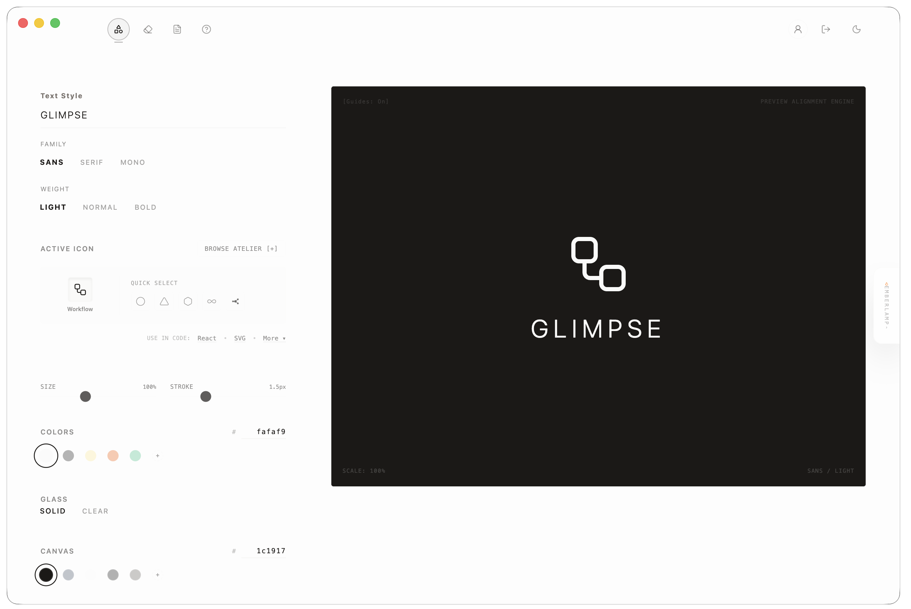
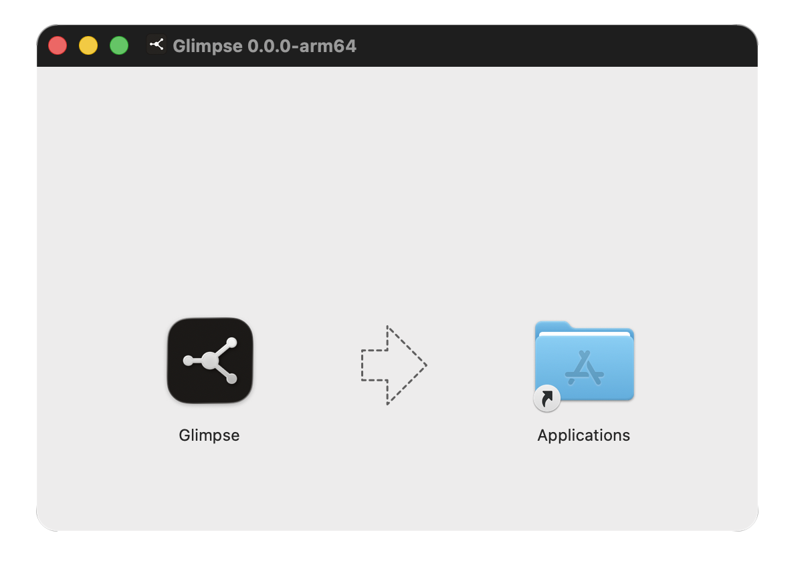

<p align="center"><strong>Glimpse</strong></p>

[](https://glimpsehosting.vercel.app)
[](runbooks/macos-desktop.md)
[](runbooks/android.md)

Glimpse creates simple marks from icons, shapes, text, and images.

<br>

<p align="center">
  
</p>

<br>

<p><strong>Open</strong></p>

| Target | Link |
| --- | --- |
|  Web | [`Open`](https://glimpsehosting.vercel.app) |
|  macOS | [`Download DMG`](https://github.com/bniladridas/glimpse/releases/download/nightly/glimpse-macos-nightly.dmg) |
|  Android | [`Download APK`](https://github.com/bniladridas/glimpse/releases/download/nightly/glimpse-android-nightly.apk) |

<br>

<p align="center">
  
</p>

<br>

<p><strong>Facts</strong></p>

| Area | Note |
| --- | --- |
| Network | The web app needs internet.<br>Background removal loads model and WASM files from public CDN hosts. |
| Runtime | Logo state, image work, and exports run in the browser.<br>The app does not add telemetry scripts. |

<br>

<!-- nightly:start -->
nightly: [2026-05-29](https://github.com/bniladridas/glimpse/releases/tag/nightly) · `4e6da9d` · gemini-2.5-flash
note: nightly app builds were refreshed.
<!-- nightly:end -->

<br>

<p><strong>Exports</strong></p>

```jsx
import { Workflow } from "lucide-react";

<Workflow size={24} strokeWidth={1.5} />
```

<br>

<p><strong>Notes</strong></p>

| Area | File |
| --- | --- |
| Setup | [`runbooks/local-setup.md`](runbooks/local-setup.md) |
| Auth | [`runbooks/supabase-google-auth.md`](runbooks/supabase-google-auth.md) |
| Desktop | [`runbooks/macos-desktop.md`](runbooks/macos-desktop.md) |
| Android | [`runbooks/android.md`](runbooks/android.md) |
| Release | [`runbooks/releases.md`](runbooks/releases.md) |
| Commits | [`runbooks/commits.md`](runbooks/commits.md) |

<br>

<p><strong>License</strong></p>

Apache-2.0.
