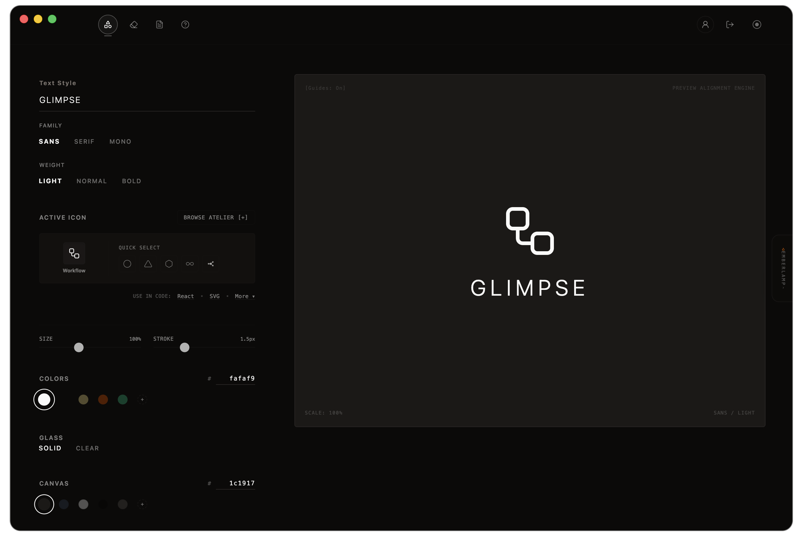

# glimpse

[](https://glimpsehosting.vercel.app)
[](runbooks/macos-desktop.md)
[](runbooks/android.md)

<br>

<p align="center">
  
</p>

<br>

logo symbols.

## app

[`glimpsehosting.vercel.app`](https://glimpsehosting.vercel.app)

## use

glimpse creates simple marks from icons, shapes, text, and images.

settings stay on the client. exported svg text is copied from the editor.

## exports

```jsx
import { Workflow } from "lucide-react";

<Workflow size={24} strokeWidth={1.5} />
```

```rust
pub const WORKFLOW_ICON: &str = r##"<svg viewBox="0 0 24 24" width="24" height="24" stroke="#fafaf9" fill="none" stroke-width="1.5">...</svg>"##;
```

```kotlin
const val WORKFLOW_SVG_ASSET = """
<svg viewBox="0 0 24 24" width="24" height="24" stroke="#fafaf9" fill="none" stroke-width="1.5">...</svg>
""".trimIndent()
```

```dart
const String workflowIconSvg = r'''<svg viewBox="0 0 24 24" width="24" height="24" stroke="#fafaf9" fill="none" stroke-width="1.5">...</svg>''';
```

## notes

| area | file |
| --- | --- |
| setup | [`runbooks/local-setup.md`](runbooks/local-setup.md) |
| auth | [`runbooks/supabase-google-auth.md`](runbooks/supabase-google-auth.md) |
| desktop | [`runbooks/macos-desktop.md`](runbooks/macos-desktop.md) |
| android | [`runbooks/android.md`](runbooks/android.md) |
| release | [`runbooks/releases.md`](runbooks/releases.md) |
| commits | [`runbooks/commits.md`](runbooks/commits.md) |

## security

do not commit secrets.

local values belong in `.env`. deployment values belong in vercel or github actions secrets.

## license

apache-2.0.
